# cairn

`cairn` 是一个面向代码仓库的本地 coding agent harness。它直接跑在终端里，先读当前工作区，再用一组受约束的工具去读文件、改文件、跑命令，并把会话状态、运行工件和长期记忆保存在本地 `.cairn/` 目录里。

它要解决的不是「模型会不会写代码」，而是**能不能把一个 code agent 做成有状态、有边界、可恢复、可复盘的工程系统**：模型只负责提出动作意图，harness 负责规定它能在什么边界内做、状态怎么留、什么才算真的完成。

## 适合做什么

- 在本地仓库里排查测试失败
- 读取当前代码结构并给出修改建议
- 基于现有文件做小步迭代，而不是脱离仓库空想
- 跨会话继续上一次没做完的工作

## 架构概览

```mermaid
flowchart TB
    subgraph entry["入口装配"]
        CLI["cli.py<br/>参数解析 · provider 选择 · 会话装配"]
    end

    subgraph control["控制面 —— 决定系统怎么跑"]
        LOOP["runtime.py · Cairn.ask&#40;&#41;<br/>感知 → 决策 → 行动 → 记录"]
        CTX["context_manager.py<br/>分段预算 · 优先级裁剪"]
        MODEL["providers/<br/>统一 complete&#40;&#41; 接口"]
        GATE["tools.py · tool_executor.py<br/>统一工具网关"]
    end

    subgraph state["状态面 —— 决定记住什么、恢复什么"]
        MEM["features/memory.py<br/>工作记忆 + 长期记忆"]
        CKPT["checkpoint.py<br/>恢复短状态 · 五态判定"]
        STORE["session_store.py · run_store.py<br/>会话状态 · 运行工件"]
    end

    subgraph evidence["证据面 —— 决定怎么被验证"]
        EVAL["evaluation/<br/>固定回归 + 四组消融实验"]
    end

    WS[("工作区 / Shell")]

    CLI --> LOOP
    LOOP -->|每轮重建 prompt| CTX
    CTX -->|prompt| MODEL
    MODEL -->|parse: tool / final / retry| LOOP
    LOOP -->|动作意图| GATE
    GATE -->|校验通过才执行| WS
    GATE -->|结果 + affected_paths| LOOP

    CTX <-.->|读取工作记忆与相关召回| MEM
    CTX <-.->|读取 checkpoint 段| CKPT
    LOOP -->|回写| MEM
    LOOP -->|触发| CKPT
    LOOP -->|落盘| STORE
    CKPT -.->|恢复前校验新鲜度与指纹| WS
    STORE -.->|工件聚合| EVAL

    classDef ctrl fill:#e8f0fe,stroke:#4285f4,color:#174ea6
    classDef st fill:#e6f4ea,stroke:#34a853,color:#137333
    classDef ev fill:#fef7e0,stroke:#fbbc04,color:#b06000
    classDef ext fill:#fce8e6,stroke:#ea4335,color:#a50e0e
    class LOOP,CTX,MODEL,GATE,CLI ctrl
    class MEM,CKPT,STORE st
    class EVAL ev
    class WS ext
```



整个系统分成三个面：

| 层 | 作用 | 对应模块 |
| --- | --- | --- |
| 控制面 | 决定系统怎么跑 | `cli.py`、`runtime.py`、`context_manager.py`、`tools.py`、`providers/` |
| 状态面 | 决定系统记住什么、恢复什么 | `features/memory.py`、`checkpoint.py`、`session_store.py`、`run_store.py` |
| 证据面 | 决定系统怎么被验证、比较、复盘 | `evaluation/`、`trace.jsonl`、`report.json` |

一条请求从终端进来后会经过五层：

1. **入口装配** — 解析工作目录、provider、审批策略、恢复模式，装配出运行现场
2. **上下文构建** — 把稳定前缀、工作记忆、相关记忆、过程历史、当前请求按预算拼成一轮 prompt
3. **控制循环** — 构建上下文 → 调模型 → 解析输出 → 执行工具 → 回写状态 → 进入下一轮
4. **工具网关** — 所有工具调用先过统一边界：白名单、参数校验、路径逃逸检测、重复调用检测、风险分级审批
5. **持久化与审计** — 会话状态服务「下次还能继续干」，运行工件服务「这次到底发生了什么」

### prompt 是怎么拼出来的

每轮 prompt 按固定顺序拼成五段，各段有独立预算和保底 floor。超预算时**不是平均裁一点**，而是按明确的优先级降级：

```text
┌─ prefix           3600  ── 角色 · 工具说明 · 仓库概要 · checkpoint 段
├─ memory           1600  ── 任务摘要 · 最近文件 · 文件短摘要
├─ relevant_memory  1200  ── 按当前请求召回的少量笔记
├─ history          5200  ── 过程历史（近 6 轮保留细节，更早的压成摘要）
└─ current_request   ∞    ── 当前用户请求，永不裁剪
                          总预算 12000 chars

超预算时的裁剪顺序：
relevant_memory ──▶ history ──▶ memory ──▶ prefix
  最先牺牲（按需补充）            最后才动（稳定复用）
```

越偏补充性的内容越早裁，越贴近当前任务主线的越晚裁。这样即使预算紧张，也能保住两件事：模型知道这轮要解决什么，以及手里还有足够的当前任务状态。

### 几个关键设计

- **prompt 每轮重建，不复用**。工作区、记忆、历史、checkpoint 都可能变，上一轮的工具结果会直接影响下一轮 prompt。
- **模型输出不直接进入执行**。中间有一层 `parse()` 判定这是工具调用、最终答案，还是需要重试的畸形输出——重试不消耗工具步数预算。
- **记忆绑内容指纹**。文件摘要绑定 SHA-256，工作区一变旧摘要立即失活——对 code agent 来说，错用旧事实比重新读一遍文件危险得多。
- **恢复不重读聊天历史**，而是走 checkpoint 短状态，并在恢复前比对文件新鲜度、workspace 指纹、工具签名和运行策略共 11 个字段，判定五种恢复状态分别处理：

```text
              ┌─ full-valid         旧状态完全可用，直接继续
              ├─ partial-stale      部分文件锚点过期 → 重新校准
  checkpoint ─┼─ workspace-mismatch 运行现场已变 → 走降级恢复
              ├─ schema-mismatch    结构不兼容 → 不硬恢复
              └─ no-checkpoint      没有恢复基础 → 重新开始
```

设计上最在意的不是恢复成功率，而是**恢复错了还继续跑**——这类错误表面上系统还在正常工作，但它已经站在一份旧状态上生成新动作了。所以评测里单独盯 `resume_false_accept_rate`。

## 安装

需要 Python 3.10+。

```bash
uv sync
```

或者装成可编辑模式：

```bash
pip install -e .
```

## 快速开始

在当前仓库里启动交互模式：

```bash
uv run cairn
```

启动后是这样：

```text
+==============================================================================+
|                                      N                                       |
|                                   \  |  /                                    |
|                                  --  +  --                                   |
|                                   /  |  \                                    |
|                                    cairn                                     |
|                        repository-native coding agent                        |
|                         bounded tools, durable state                         |
+------------------------------------------------------------------------------+
|                                                                              |
| WORKSPACE  ~/code/cairn                                                      |
| MODEL     deepseek-v4-pro              BRANCH    main                        |
| APPROVAL  ask                          SESSION   20260902-151655-d75ea3      |
|                                                                              |
+==============================================================================+

cairn>
```

指定另一个工作目录：

```bash
uv run cairn --cwd /path/to/repo
```

直接跑一次性任务：

```bash
uv run cairn "inspect the test failures and propose a fix"
```

也可以用模块入口：

```bash
python -m cairn
```

## 模型后端

支持五类模型后端：

- DeepSeek（Anthropic-compatible Messages API，默认）
- OpenAI 兼容 Responses API
- Anthropic 兼容 Messages API
- Gemini 兼容 Chat Completions API
- Ollama（本地）

Cairn 启动时会读取项目根目录的 `.env`。本地真实 key 放在 `.env`，仓库只保留 `.env.example`。配置优先级是：

```text
显式 CLI 参数 > .env 里的 CAIRN_* 变量 > 旧环境变量 > 代码默认值
```

Provider 选择顺序：

```text
--provider > CAIRN_PROVIDER > 代码默认 deepseek
```

`.env` 会在构建 provider client 前加载，并覆盖当前进程里的同名环境变量。模型名和 base URL 可以通过 `--model`、`--base-url` 临时覆盖；API key 只从环境变量读取。

本地第一次配置：

```bash
cp .env.example .env
```

然后把要使用的 provider key 填进去。`.env` 已经被 `.gitignore` 忽略，不要提交真实 key。

### 推荐配置：DeepSeek

最小配置只需要 key：

```bash
CAIRN_DEEPSEEK_API_KEY="your-api-key"
```

默认模型和接口是：

```bash
CAIRN_DEEPSEEK_API_BASE="https://api.deepseek.com/anthropic"
CAIRN_DEEPSEEK_MODEL="deepseek-v4-pro"
```

所以常规情况下 `.env` 里只填 `CAIRN_DEEPSEEK_API_KEY` 就能直接启动。如果需要临时切模型或代理地址，不必改 `.env`：

```bash
uv run cairn --model deepseek-v4-pro --base-url https://api.deepseek.com/anthropic
```

DeepSeek 当前走 Anthropic-compatible Messages API，所以 runtime 里复用的是 Anthropic-compatible client；这只影响 HTTP 协议，不影响 CLI 用法。

Cairn 当前使用文本编码的工具协议，因此会在 DeepSeek 请求中显式关闭 provider-native thinking，避免思考内容耗尽单步输出预算或产生无法回放的 thinking block。后续如果接入原生工具协议，需要同时实现 thinking block 的完整回放，不能只删除这个开关。

### 当前 provider 环境变量

| provider | base URL | API key | model |
| --- | --- | --- | --- |
| `deepseek` | `CAIRN_DEEPSEEK_API_BASE`，回退 `DEEPSEEK_API_BASE`，默认 `https://api.deepseek.com/anthropic` | `CAIRN_DEEPSEEK_API_KEY`，回退 `DEEPSEEK_API_KEY` | `CAIRN_DEEPSEEK_MODEL`，回退 `DEEPSEEK_MODEL`，默认 `deepseek-v4-pro` |
| `openai` | `CAIRN_OPENAI_API_BASE`，回退 `OPENAI_API_BASE` | `CAIRN_OPENAI_API_KEY`，回退 `OPENAI_API_KEY` 等 | `CAIRN_OPENAI_MODEL`，回退 `OPENAI_MODEL`，默认 `gpt-5.4` |
| `anthropic` | `CAIRN_ANTHROPIC_API_BASE`，回退 `ANTHROPIC_API_BASE` | `CAIRN_ANTHROPIC_API_KEY`，回退 `ANTHROPIC_API_KEY` 等 | `CAIRN_ANTHROPIC_MODEL`，回退 `ANTHROPIC_MODEL`，默认 `claude-sonnet-4-6` |
| `gemini` | `CAIRN_GEMINI_API_BASE`，回退 `GEMINI_API_BASE` | `CAIRN_GEMINI_API_KEY`，回退 `GEMINI_API_KEY` | `CAIRN_GEMINI_MODEL`，回退 `GEMINI_MODEL`，默认 `gemini-2.5-flash-lite` |
| `ollama` | `--host`，默认 `http://127.0.0.1:11434` | 不需要 | `--model`，默认 `qwen3.5:4b` |

切换 provider：

```bash
uv run cairn --provider openai
uv run cairn --provider anthropic
uv run cairn --provider gemini
```

本地 Ollama：

```bash
ollama serve
ollama pull qwen3.5:4b
uv run cairn --provider ollama --model qwen3.5:4b
```

如果有额外的敏感环境变量需要从 trace/report 里脱敏，可以用 `CAIRN_SECRET_ENV_NAMES` 配置逗号分隔的变量名，或启动时重复传 `--secret-env-name NAME`。

## 常用交互命令

- `/help`：查看内置命令
- `/memory`：查看提炼后的工作记忆
- `/session`：查看当前会话文件路径
- `/reset`：清空当前会话状态
- `/exit` 或 `/quit`：退出 REPL

## 安全与持久化

`cairn` 不会默认把所有动作都放开。工具按副作用分级，shell、写文件、打补丁这类高风险操作受审批模式控制：

- `--approval ask`：高风险动作先问
- `--approval auto`：受控放行
- `--approval never`：直接拦

工具执行前会统一做白名单校验、参数 schema 校验、路径逃逸检测（先解析成绝对路径再判断是否仍落在工作区内，同时拦住 `../` 显式逃逸和符号链接隐式跳出）和重复调用检测。`run_shell` 只继承白名单环境变量，trace/report 落盘前对密钥做脱敏。

每次运行结束后，都会在 `.cairn/runs/<run_id>/` 下写出三类工件：

- `task_state.json` — 运行中的状态快照
- `trace.jsonl` — 逐事件时间线
- `report.json` — 收口后的聚合摘要

磁盘布局：

```text
.cairn/
├── sessions/<session_id>.json      会话级状态，面向「继续工作」
├── runs/<run_id>/                  单次运行工件，面向「回放与审计」
│   ├── task_state.json
│   ├── trace.jsonl
│   └── report.json
└── memory/                         长期记忆，面向「跨会话仍成立的事实」
    ├── MEMORY.md
    └── topics/
```

这些内容默认只保存在本地，不需要跟仓库一起提交。

## 评测

评测没有做成一个总分，而是按问题分层，每层有独立证据。最近一次完整运行的结果和复现说明在
[`benchmarks/results/main-resume-repro-2026-09-02/`](benchmarks/results/main-resume-repro-2026-09-02/)。

| 层 | 关键结果 |
| --- | --- |
| Harness regression | 12 个固定任务，pass_rate / within_budget_rate / verifier_pass_rate 均 100%；完成与否由外部 verifier 判定，不看模型自述 |
| 上下文治理 | 12 组压力配置，平均 prompt 6951 → 5533 字符，平均压缩率 16.44%，最高 33.75%，当前请求保留率 100% |
| 记忆收益 | 12 个记忆依赖任务，follow-up 阶段重复读文件 60 → 0 次；塞入无关记忆的对照组仍是 60 次 |
| 恢复正确性 | 10 个恢复场景，workspace 漂移识别率 100%，误信旧状态继续执行率 0%，恢复成功率 90% |
| 工具安全 | 10 类越权 / 非法调用场景，27 次执行注入全部在执行前拦截，每次都带可归因错误码 |

所有实验使用 `FakeModelClient` 和 fixture 仓库，与具体 provider 能力解耦，可确定性复现。各指标的口径边界和测法见上面目录里的 `DATA_PROVENANCE.md`。

几个刻意保留的口径：

- 恢复成功率 90% 里那 10% 是**故意留的**——checkpoint schema 不兼容且无可信恢复状态的场景，用来验证系统不会硬恢复。
- 记忆实验有三组而不是两组：`memory_on` / `memory_off` / **保留记忆框架但塞无关内容**。第三组的重复读同样是 60 次，这才能说明收益来自结构化且相关的记忆，而不是「多塞了点上下文」。
- 安全实验里符号链接场景在未开启开发者模式的 Windows 上跳过（3 次），**跳过不计入拦截率分母**——它没有证明任何事情。

## 开发

常用本地检查：

```bash
uv run pytest tests -q
uv run ruff check cairn tests scripts
```

内部代码按较轻的边界拆分：`cairn/evaluation/` 放 benchmark 和 metrics，`cairn/providers/` 放模型 provider client，`cairn/features/` 放可选运行时能力。新代码应直接使用这些包路径。

`examples/mini-cairn/` 是一个精简版实现，用来说明这套 harness 的最小骨架。
